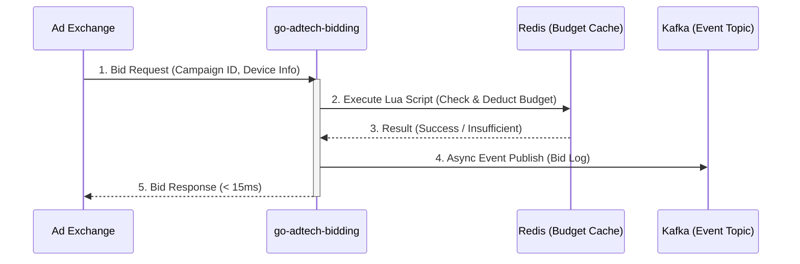

# 🚀 go-adtech-bidding (Ultra-Low Latency RTB Engine)


**go-adtech-bidding**은 대규모 실시간 광고 입찰(RTB, Real-Time Bidding) 환경을 가정하여 설계된 초저지연(Ultra-Low Latency) 입찰 엔진 프로토타입입니다. 

하루 3억 건 이상의 입찰 요청이 발생하는 DSP(Demand-Side Platform) 환경에서, 단일 입찰 요청에 대한 **p99 응답 시간 15ms 이하** 달성과 **분산 환경에서의 원자적 예산 제어(Atomic Budget Pacing)**를 목표로 구현되었습니다.

## ✨ 핵심 기능 및 아키텍처 특장점 (Key Features)

* **Ultra-Low Latency API**: Go 언어의 고성능 HTTP 프레임워크(Fiber)를 활용하여 네트워크 I/O 병목 최소화.
* **Lock-Free 동시성 제어**: 분산 락(Distributed Lock)으로 인한 지연 현상을 제거하기 위해, **Redis Lua Script**를 도입하여 1회의 네트워크 통신(RTT)만으로 '잔여 예산 확인 및 차감(Check-Then-Act)'의 원자성(Atomicity) 보장.
* **비동기 이벤트 파이프라인**: 입찰 처리 로직(Critical Path)에서 무거운 DB 쓰기 작업을 배제하고, 핵심 입찰 성공 데이터는 **Kafka**로 비동기 발행하여 RDBMS 동기화 지연 원천 차단.

## 🏗 아키텍처 흐름 (Architecture Flow)



## 📂 디렉토리 구조 (Directory Structure)

도메인 주도 설계(DDD)와 클린 아키텍처(Clean Architecture) 원칙을 차용하여 비즈니스 로직과 인프라스트럭처 의존성을 분리했습니다.

```text
go-adtech-bidding/
├── cmd/
│   └── bidder/                 # 애플리케이션 진입점 (main.go)
├── internal/                   
│   ├── domain/                 # 도메인 모델 (BidRequest, Campaign 등)
│   ├── delivery/http/          # HTTP 핸들러 및 라우팅
│   ├── usecase/                # 비즈니스 로직 및 흐름 제어
│   └── repository/             # Redis 통신(Lua) 및 Kafka 발행 인프라 로직
├── scripts/                    
│   ├── lua/                    # 원자적 예산 차감을 위한 Redis Lua Scripts
│   └── k6/                     # 성능 부하 테스트 시나리오 스크립트
├── docker-compose.yml          # Redis, Kafka 로컬 테스트 환경
└── Makefile                    # 빌드 및 테스트 자동화 스크립트

```

## 🚀 시작하기 (Getting Started)

### Prerequisites

* Go 1.22+
* Docker & Docker Compose
* Make

### Installation & Run

```bash
# 1. 의존성 인프라(Redis, Kafka) 실행
$ make compose-up

# 2. Bidding 서버 실행
$ make run

```

## 📊 성능 평가 및 트러블슈팅 (Performance & Tuning)

본 프로젝트는 로컬 환경(Docker for Mac)에서 **k6**를 활용하여 부하 테스트를 진행하며, 아키텍처의 병목 지점을 식별하고 튜닝하는 과정을 거쳤습니다.

### 1. 테스트 환경 및 결과 지표

* **목표 지표:** 단일 API 요청에 대한 **p(99) 응답 시간 15ms 이하** 보장 및 성공률 99.9% 달성
* **테스트 부하:** 500 VUs (Virtual Users), 약 14,000건의 입찰 요청
* **실패율 (Error Rate):** `0.00%` (14,077건 중 0건 실패)
* **중간값 (Median Latency):** `6.34ms`
* **p(90) Latency:** `16.60ms`
* **p(99) Latency:** `28.63ms`

### 2. 주요 트러블슈팅 내역

#### 🔴 Issue 1: 대규모 동시 접속 시 Connection Drop 발생

* **현상:** 초기 테스트 시 초당 1,000건 이상의 요청이 유입될 때 `server closed idle connection` 에러와 함께 5% 이상의 요청 실패율 발생.
* **원인 & 해결:** Fiber 프레임워크의 `ReadTimeout`을 AdTech 목표치인 15ms로 타이트하게 설정하여 OS 네트워크 계층의 패킷 읽기 지연을 수용하지 못한 것이 원인. 인프라 계층의 타임아웃(`2s`)과 비즈니스 로직 타임아웃(`context.WithTimeout 15ms`)을 분리하여 실패율을 **0.00%로 개선**.

#### 🔴 Issue 2: Redis 커넥션 풀 경합으로 인한 Max Latency 스파이크

* **현상:** 실패율은 잡혔으나, 간헐적으로 특정 요청의 응답 시간이 200ms 이상 치솟는 현상 발생.
* **원인 & 해결:** Go 고루틴 수천 개가 동시 실행되나, Redis `PoolSize`가 100으로 설정되어 수많은 스레드가 Lock 상태로 대기하는 병목 발생. `PoolSize`를 2,500으로 확장하여 대기 시간을 원천 차단함.

### 3. 지표 분석 및 회고

비차단(Non-blocking) 파이프라인(Kafka)과 Redis Lua 스크립트를 적용한 결과, 전체 요청의 절반 이상(Median)이 **6.34ms** 만에 처리되었습니다. 이는 핵심 비즈니스 로직이 15ms 제약을 돌파할 수 있을 만큼 경량화되었음을 증명합니다.

다만, 간헐적인 지연 시간 상승으로 인해 p(99) 방어(28.63ms)에는 다소 한계를 보였습니다. 이는 Mac 환경의 Docker 브릿지 네트워크가 유발하는 TCP 큐잉 지연과, 단시간 내 대량의 JSON 파싱으로 인한 Go 언어의 가비지 컬렉션(GC) 스파이크가 주요 원인으로 파악됩니다. 추후 Linux Native 환경 배포 및 `sync.Pool` 객체 재사용 튜닝을 통해 더욱 견고한 레이턴시 방어율을 달성할 수 있을 것으로 기대합니다.

## 📄 License

This project is licensed under the Apache License 2.0 - see the [LICENSE](https://www.google.com/search?q=LICENSE) file for details.
