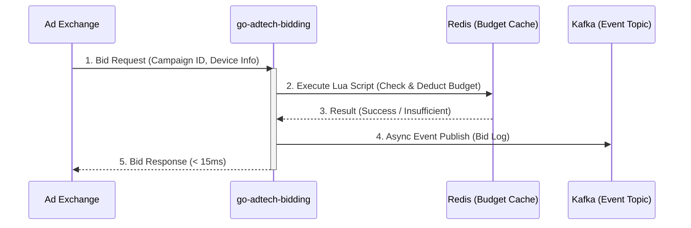

# 🚀 go-adtech-bidding (Ultra-Low Latency RTB Engine)


**go-adtech-bidding**은 대규모 실시간 광고 입찰(RTB, Real-Time Bidding) 환경을 가정하여 설계된 초저지연(Ultra-Low Latency) 입찰 엔진 프로토타입입니다. 

하루 3억 건 이상의 입찰 요청이 발생하는 DSP(Demand-Side Platform) 환경에서, 단일 입찰 요청에 대한 **p99 응답 시간 15ms 이하** 달성과 **분산 환경에서의 원자적 예산 제어(Atomic Budget Pacing)**를 목표로 구현되었습니다.

## ✨ 핵심 기능 및 아키텍처 특장점 (Key Features)

* **Ultra-Low Latency API**: Go 언어의 고성능 HTTP 프레임워크(예: Fiber/FastHTTP)를 활용하여 네트워크 I/O 병목 최소화.
* **Lock-Free 동시성 제어**: 분산 락(Distributed Lock)으로 인한 지연 현상을 제거하기 위해, **Redis Lua Script**를 도입하여 1회의 네트워크 통신(RTT)만으로 '잔여 예산 확인 및 차감(Check-Then-Act)'의 원자성(Atomicity) 보장.
* **비동기 이벤트 파이프라인**: 입찰 처리 로직(Critical Path)에서 무거운 DB 쓰기 작업을 배제하고, 핵심 입찰 성공 데이터는 **Kafka**로 비동기 발행하여 RDBMS 동기화 지연 원천 차단.

## 🏗 아키텍처 흐름 (Architecture Flow)



## 📂 디렉토리 구조 (Directory Structure)

도메인 주도 설계(DDD)와 클린 아키텍처(Clean Architecture) 원칙을 차용하여 비즈니스 로직과 인프라스트럭처 의존성을 분리했습니다.

```text
go-adtech-bidding/
├── cmd/
│   └── bidder/                 # 애플리케이션 진입점 (main.go)
├── internal/                   
│   ├── domain/                 # 도메인 모델 (BidRequest, Campaign 등)
│   ├── delivery/http/          # HTTP 핸들러 및 라우팅
│   ├── usecase/                # 비즈니스 로직 및 흐름 제어
│   └── repository/             # Redis 통신(Lua) 및 Kafka 발행 인프라 로직
├── scripts/                    
│   ├── lua/                    # 원자적 예산 차감을 위한 Redis Lua Scripts
│   └── k6/                     # 성능 부하 테스트 시나리오 스크립트
├── docker-compose.yml          # Redis, Kafka, Zookeeper 로컬 테스트 환경
└── Makefile                    # 빌드 및 테스트 자동화 스크립트

```

## 🚀 시작하기 (Getting Started)

### Prerequisites

* Go 1.22+
* Docker & Docker Compose
* Make

### Installation & Run

```bash
# 1. 의존성 인프라(Redis, Kafka) 실행
$ make compose-up

# 2. Bidding 서버 실행
$ make run

```

## 📊 성능 평가 (Performance Evaluation)

> **Note:** 아래는 k6를 활용하여 초당 5,000건(5,000 TPS)의 동시 입찰 요청을 발생시켰을 때의 부하 테스트 결과입니다. (프로젝트 완성 후 실제 수치로 업데이트 예정)

* **Test Tool**: k6
* **Target TPS**: 5,000 req/sec
* **Latency Metrics**:
* **p95**: `X.X ms` (목표: < 10ms)
* **p99**: `X.X ms` (목표: < 15ms)


* **Success Rate**: `99.99%`

### 성능 최적화 포인트 (Performance Tuning)

* *여기에 추후 진행하실 GC 튜닝, Connection Pool 최적화, 메모리 풀링(sync.Pool) 적용 등의 기술적 고민과 결과를 기록하시면 매우 좋습니다.*

## 📄 License

This project is licensed under the Apache License 2.0 - see the [LICENSE](https://www.google.com/search?q=LICENSE) file for details.
